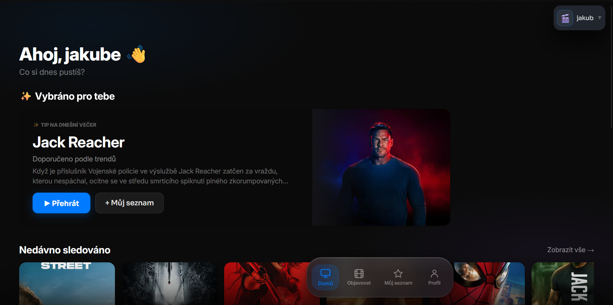
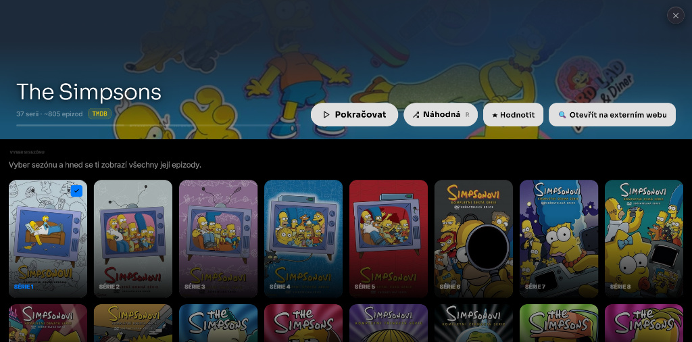
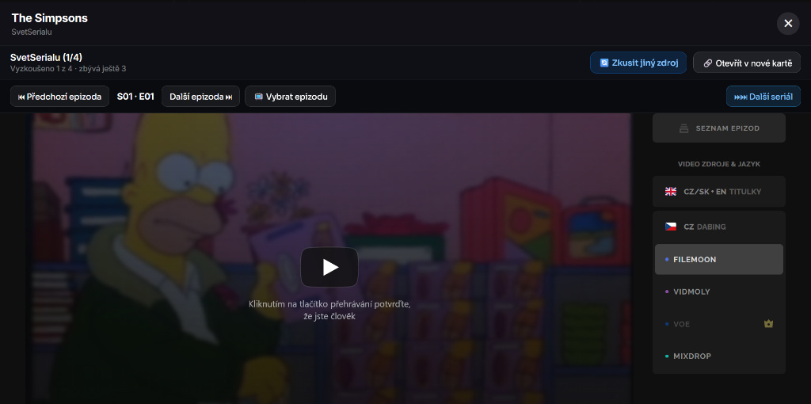

[README.md](https://github.com/user-attachments/files/32415545/README.md)
<div align="center">

# 🎬 MůjFlix

**Osobní streamovací hub ve stylu Netflixu — jedno místo pro filmy, seriály a objevování. 100% zdarma.**


<br>


<br>


</div>

---

## 📖 O projektu

MůjFlix je **osobní streamovací hub** ve stylu Netflixu — jedno místo, kde si spravuješ, co sleduješ, objevuješ nové filmy a seriály, a **rovnou je i pustíš úplně zdarma**.

> 💰 **Zdarma, bez předplatného, bez reklam.** Žádné měsíční poplatky, žádný premium tarif, žádné skryté poplatky. Prostě otevřeš appku a koukáš.
>
> 💡 **Žádná instalace, žádný build.** Čistě statická webová appka (HTML/CSS/JS), běží přímo v prohlížeči.
>
> 🐛 **Pozor — ještě to má mouchy!** Není to 100% doladěné. Občas něco blbne, něco se nenačte, něco se rozbije. Ale s bráchou na tom makáme a postupně **všechno doladíme**. Ber to tak, že je to **živý projekt ve vývoji** — ne hotový produkt. 👍
>
> 📱 **Mobilní verze je teprve v plenkách!** 🚧 Na telefonu to zatím není zdaleka tak vyladěné jako na desktopu. Pracujeme na tom, ale chce to čas. **Pro nejlepší zážitek doporučujeme zatím používat desktop.** 🖥️

---

## 🩹 Poslední opravy

- 🧭 **Dock** (Objevovat / Můj seznam / Profil) — nereagoval kvůli špatnému pořadí načítání scriptů; teď funguje spolehlivě hned od prvního kliknutí
- 🔒 **PIN obrazovka** — byla neviditelná (schovaná za obrazovkou výběru profilu kvůli špatnému z-indexu), teď se zobrazuje správně
- 👤 **Výběr profilu** — nový, sjednocený vzhled (kruhové avatary s barevným prstencem), smazané duplicitní tlačítko "Přidat profil"
- 🎨 **Dock a celkový vzhled** — sjednocené barvy/styly (dřív se přes sebe rvalo víc CSS souborů najednou)
- 🐌 **Sekání appky** — omezeno zbytečné opakované přepočítávání layoutu hned po startu appky
- 🧹 **Úklid kódu** — smazané nepoužívané soubory a stovky mrtvých CSS pravidel ze starších verzí appky
- 🔑 **API klíč** — přesunutý do `config.js` (mimo git, viz sekce Spuštění níže), do repozitáře jde jen vzor

---

## ⚠️ Status projektu

Tenhle projekt **NENÍ finální verze**. Je to **work-in-progress**, který pořád roste a mění se.

- 🐛 **Bugy a mouchy** — občas se něco rozbije, občas něco nefunguje jak má
- 🚧 **Nedotažené detaily** — UI, UX a funkce se ještě ladí
- 📱 **Mobilní verze ve vývoji** — na telefonu je to teprve v plenkách, pracujeme na tom
- 🔧 **Postupný vývoj** — s bráchou to pomalu ale jistě vylepšujeme
- 💬 **Zpětná vazba vítána** — když najdeš bug, klidně napiš

**Slibujeme:** budeme se snažit to co nejvíc doladit, aby to fungovalo tak, jak má. 🫡

> 🖥️ **Tip:** Prozatím doporučujeme používat **desktop verzi** — mobilní zážitek ještě není tam, kde bychom chtěli.

---

## 📸 Screenshoty

<div align="center">

### 🏠 Hlavní stránka


<br><br>

### 🎬 Detail seriálu + výběr sezóny


<br><br>

### 🎥 Cinema mód s výběrem zdroje


</div>

---

## ✨ Funkce

<table>
<tr>
<td width="50%" valign="top">

### 🏠 Domovská obrazovka
- Přehled seriálů s **progress barem**
- Odznak **„pokračovat"** ukazuje, kde jsi skončil
- Dlaždice se automaticky přeskládají podle aktivity

### 🧭 Objevování
- Procházení podle **žánru, popularity, hodnocení** (TMDB)
- Filtrování podle **víc žánrů najednou**
- Fulltextové vyhledávání

### 🎥 Cinema mód
- Přehrávání přes víc externích zdrojů
- Automatický fallback při selhání zdroje
- U seriálů: **Další / Předchozí epizoda**, výběr epizody, skok na další seriál
- **„Přidat do seznamu"** přímo z přehrávače

</td>
<td width="50%" valign="top">

### 📋 Můj seznam
- Ulož si, co chceš zhlédnout později
- Vše na jednom místě, synchronizováno

### 👤 Profily
- **Víc profilů** na jednom zařízení (jako Netflix)
- Volitelné **zamčení PIN kódem**

### 🔄 Cross-device sync
- Rozkoukanost a seznam mezi zařízeními
- 🟢 Zelená tečka = synchronizováno

### 🤖 AI asistent
- Doporučení podle nálady nebo žánru
- Zná tvoji historii sledování

</td>
</tr>
</table>

---

## 💰 Proč MůjFlix?

| | **MůjFlix** | Netflix | HBO Max | Disney+ |
|---|:---:|:---:|:---:|:---:|
| **Cena** | 🟢 **Zdarma** | ~250 Kč/měs | ~200 Kč/měs | ~200 Kč/měs |
| **Reklamy** | ❌ Ne | ⚠️ V Basic | ⚠️ V Basic | ⚠️ V Basic |
| **Vlastní zdroje** | ✅ Ano | ❌ Ne | ❌ Ne | ❌ Ne |
| **Bez instalace** | ✅ PWA | ❌ App | ❌ App | ❌ App |
| **Vlastní profily** | ✅ Neomezeně | ⚠️ Limit | ⚠️ Limit | ⚠️ Limit |
| **Mouchy a bugy** | 🐛 Občas 😅 | 🟢 Ne | 🟢 Ne | 🟢 Ne |
| **Mobilní verze** | 🚧 Ve vývoji | 🟢 Hotová | 🟢 Hotová | 🟢 Hotová |

**Prostě koukáš — zadarmo, bez omezení.**

---

## 🚀 Spuštění

MůjFlix je **čistě statická webová appka** — žádný build krok, žádné závislosti.

### 🌐 Nasazená verze

Nejjednodušší způsob — otevřít nasazenou verzi v prohlížeči. Pokud je projekt napojený na **Cloudflare Pages**, běží na tvé `.pages.dev` doméně nebo vlastní doméně.

### 💻 Lokální spuštění

```bash
git clone https://github.com/jablkooo/mujflix.git
cd mujflix
cp config.example.js config.js
```

Pak do `config.js` vlož svůj vlastní **TMDB API klíč** (zdarma na
[themoviedb.org/settings/api](https://www.themoviedb.org/settings/api)) —
bez něj se nenačtou obrázky ani popisky filmů/seriálů. `config.js` je v
`.gitignore`, takže zůstane jen u tebe a nikdy se nenahraje na GitHub.

```bash
python3 -m http.server 8000
```

Pak otevři 👉 **http://localhost:8000**

Stejný krok (zkopírovat `config.example.js` → `config.js` a vyplnit klíč)
udělej i při nasazení na hosting (Cloudflare Pages atd.) — `config.js`
nahraj ručně/mimo git spolu s ostatními soubory.

### ✅ Podporované prohlížeče

| Prohlížeč | Desktop | Mobil |
|-----------|:-------:|:-----:|
| Chrome    |    ✅   |   🚧  |
| Safari    |    ✅   |   🚧  |
| Firefox   |    ✅   |   🚧  |
| Edge      |    ✅   |   🚧  |

> 🖥️ **Desktop** = plně funkční &nbsp;•&nbsp; 📱 **Mobil** = ve vývoji 🚧
>
> 📱 Appku jde přes **„Přidat na plochu"** nainstalovat jako **PWA** — ikonka jako klasická appka, spouští se na plné obrazovce. *(Ale pozor — mobilní verze je zatím v plenkách.)*

---

## 🛠️ Tech Stack

<div align="center">

| Vrstva | Technologie |
|--------|-------------|
| **Frontend** | HTML5, CSS3 (Glassmorphism, Dark UI), Vanilla JavaScript |
| **Data** | TMDB API (filmy, seriály, žánry) |
| **Streaming** | Externí zdroje (Bombuj, Prehrajto.cz, Uzi.la, SvetSerialu) |
| **AI** | AI asistent pro doporučení |
| **Deploy** | Cloudflare Pages |
| **PWA** | Service Worker + Manifest |

</div>

---

## 🗺️ Roadmap

- [x] Domovská obrazovka s progress barem
- [x] Objevování podle žánrů (TMDB)
- [x] Cinema mód s víc zdroji
- [x] Profily + PIN
- [x] Cross-device sync
- [x] AI asistent
- [ ] Vyladit bugy a mouchy 🐛
- [ ] **Vyladit mobilní verzi** 📱
- [ ] Offline režim (service worker cache)
- [ ] Sdílení seznamu s přáteli
- [ ] Statistiky sledování (kolik hodin, top žánry)
- [ ] Tmavý/světlý režim přepínač
- [ ] Vlastní zdroje pro přehrávání

---

## ⚠️ Upozornění

> **MůjFlix je osobní / vzdělávací projekt** pro organizaci vlastní sledovanosti.
>
> Odkazy na externí streamovací weby jsou jen **zprostředkované** — MůjFlix sám **žádný obsah nehostuje ani nedistribuuje**.
>
> Dostupnost a legálnost obsahu na jednotlivých zdrojích si **řiď podle pravidel platných ve své zemi**.

---

## 🤝 Přispívání

Projekt je primárně osobní, ale **PR a nápady jsou vítány**. Pokud chceš přispět:

1. Forkni repo
2. Vytvoř branch (`git checkout -b feature/napad`)
3. Commitni změny (`git commit -m 'Add: skvělá funkce'`)
4. Pushni (`git push origin feature/napad`)
5. Otevři **Pull Request**

---

## 👥 Kdo za tím stojí

<div align="center">

<table>
<tr>
<td align="center" width="33%">
<a href="https://github.com/jablkooo">
<br>
<sub><b>jablkooo</b></sub>
</a><br>
👨‍💻 <b>Owner & Developer</b><br>
<sub>Hlavní nápad, vývoj, design</sub>
</td>
<td align="center" width="33%">
<a href="https://github.com/jirulaso43">
<br>
<sub><b>jirulaso43</b></sub>
</a><br>
🤝 <b>Co-owner & Developer</b><br>
<sub>Spolupráce, testování, feedback</sub>
</td>
<td align="center" width="33%">
<br>
<sub><b>AI asistenti</b></sub><br>
🤖 <b>Vývojoví parťáci</b><br>
<sub>Kód, nápady, debugging</sub>
</td>
</tr>
</table>

<br>

**Vytvořeno s náma a spoustou AI.** 🤖✨

Bez AI by to nebylo tam, kde to je. Díky, ChatGPT, Claude a spol.!

</div>

---

## 🛠️ Pro vývojáře

Architektura, souborová struktura a poznámky k údržbě jsou v **[`DEVELOPMENT.md`](./DEVELOPMENT.md)**.

---

<div align="center">


**🎬 MůjFlix** — *your movies, your rules. For free.*


</div>
